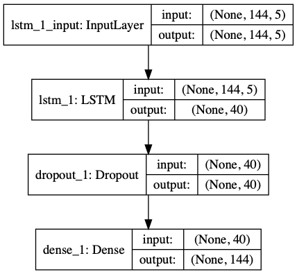
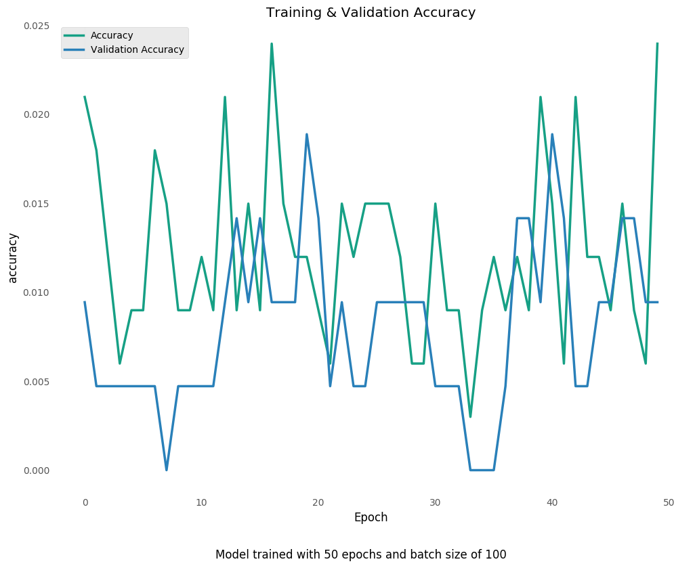
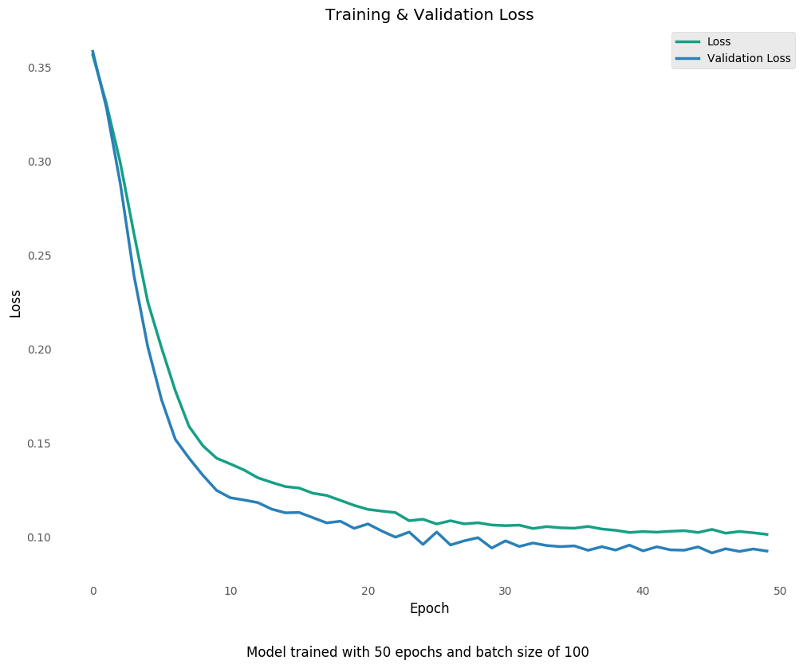
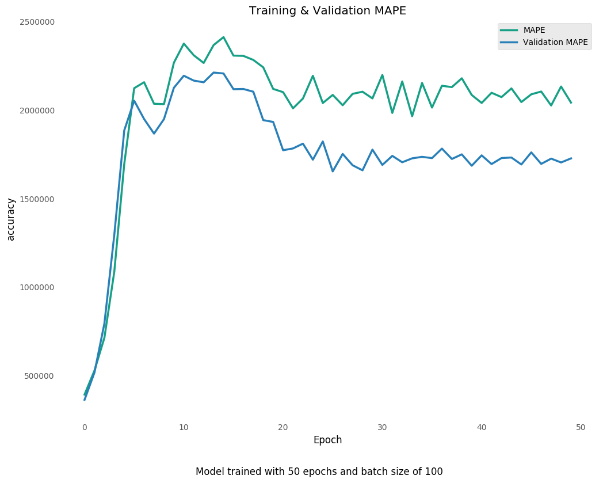
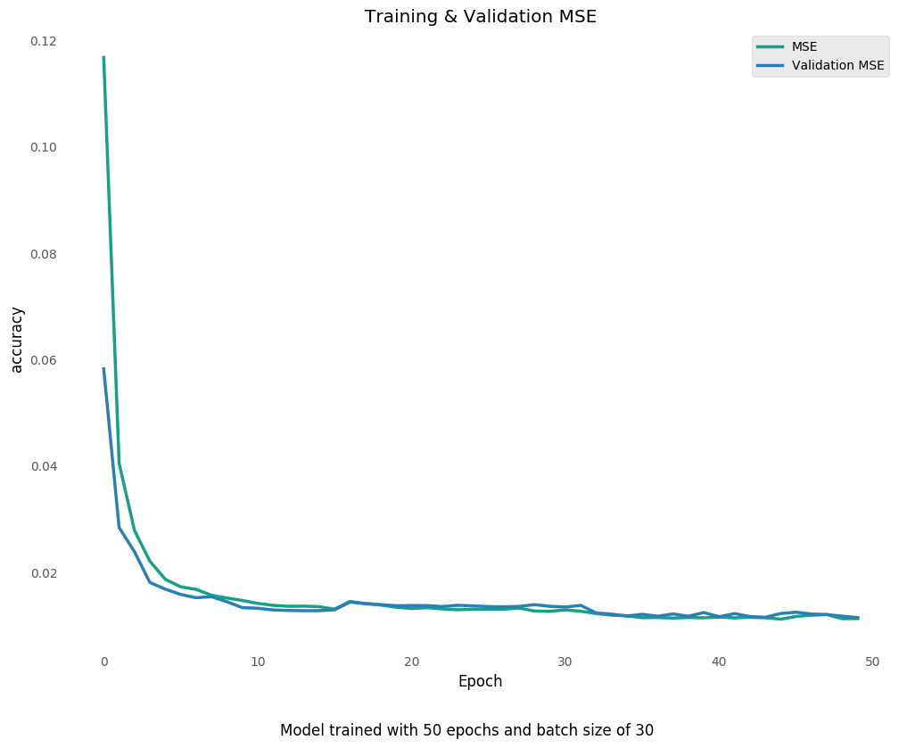
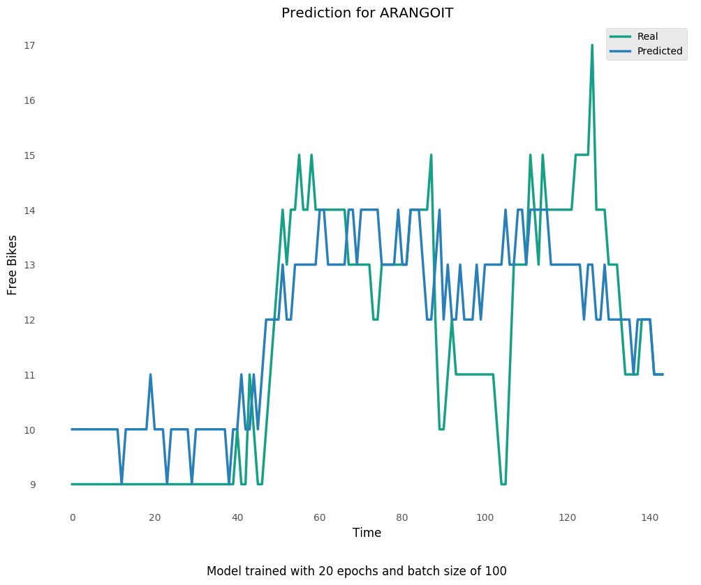
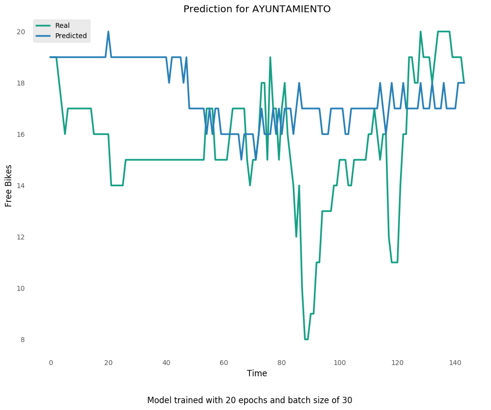
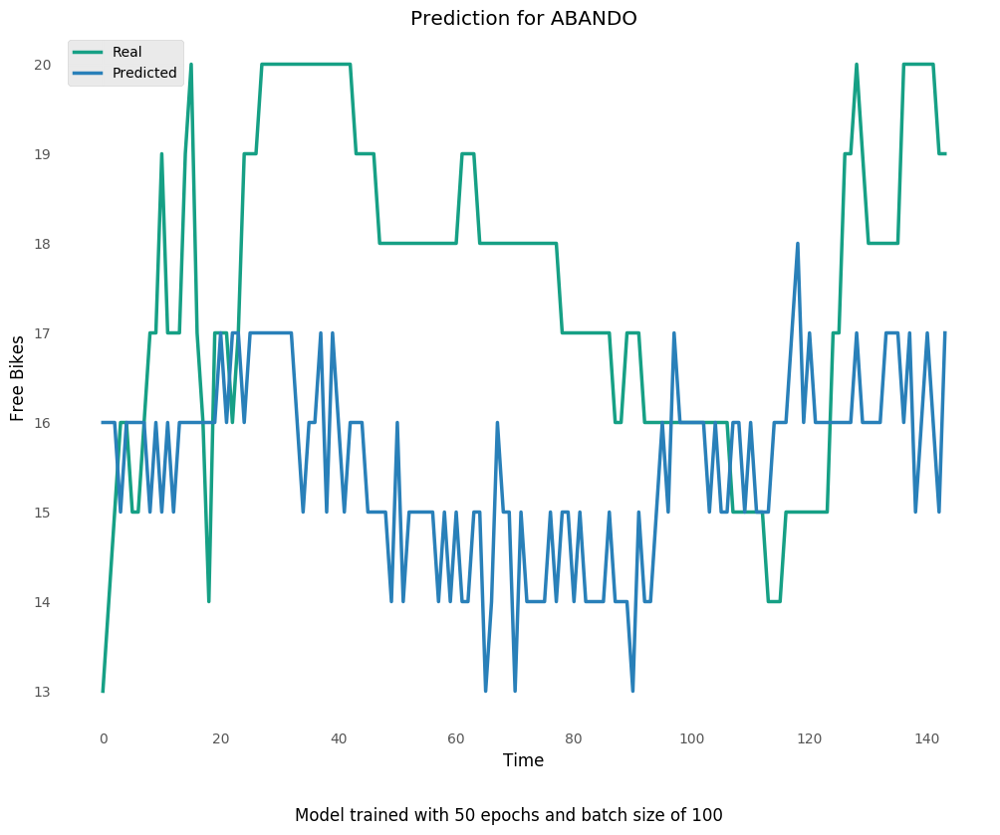

# Steps

Pasos realizados para entrenar la red neuronal
## Reading Dataset


Reading dataset, data gathered every ten minutes.

```
    datetime   time  weekday            station  free_bikes
0        331  15:40  TUESDAY         BLAS OTERO          27
1        331  15:40  TUESDAY       AYUNTAMIENTO          20
2        331  15:40  TUESDAY            ARRIAGA          30
3        331  15:40  TUESDAY         ASKATASUNA          13
4        331  15:40  TUESDAY            REKALDE          19
5        331  15:40  TUESDAY           AREILTZA          14
6        331  15:40  TUESDAY           TERMIBUS          21
7        331  15:40  TUESDAY          ASTILLERO          11
8        331  15:40  TUESDAY           EGUILLOR          16
9        331  15:40  TUESDAY      ANSELMO CLAVE          14
10       331  15:40  TUESDAY           INDAUTXU          23
11       331  15:40  TUESDAY           LEIZAOLA          29
12       331  15:40  TUESDAY          IBAIZABAL           7
13       331  15:40  TUESDAY  PLAZA ENCARNACIÓN          12
14       331  15:40  TUESDAY          SAN PEDRO          15
15       331  15:40  TUESDAY            BOLUETA          19
16       331  15:40  TUESDAY         OTXARKOAGA          10
17       331  15:40  TUESDAY           OLABEAGA          17
18       331  15:40  TUESDAY            SARRIKO          20
19       331  15:40  TUESDAY              HEROS          16
20       331  15:40  TUESDAY              EGAÑA          20
21       331  15:40  TUESDAY         ETXEBARRIA          12
22       331  15:40  TUESDAY     GABRIEL ARESTI          17
23       331  15:40  TUESDAY             ABANDO          20
24       331  15:40  TUESDAY    ESTRADA CALEROS          18
25       331  15:40  TUESDAY             EPALZA          25
26       331  15:40  TUESDAY           AMETZOLA          14
27       331  15:40  TUESDAY       SABINO ARANA          18
28       331  15:40  TUESDAY      CORAZÓN MARIA          19
29       331  15:40  TUESDAY            KARMELO          12
30       331  15:50  TUESDAY            LEVANTE          19
31       331  15:50  TUESDAY         BLAS OTERO          27
32       331  15:50  TUESDAY       AYUNTAMIENTO          20
33       331  15:50  TUESDAY            ARRIAGA          28
34       331  15:50  TUESDAY         ASKATASUNA          15
35       331  15:50  TUESDAY            REKALDE          20
36       331  15:50  TUESDAY           AREILTZA          13
37       331  15:50  TUESDAY           TERMIBUS          22
38       331  15:50  TUESDAY          ASTILLERO          11
39       331  15:50  TUESDAY           EGUILLOR          16
```

## Encoding Data


Encode each column as integers
Got list of 31 stations before encoding

```
['ABANDO', 'AMETZOLA', 'ANSELMO CLAVE', 'AREILTZA', 'ARRIAGA', 'ASKATASUNA', 'ASTILLERO', 'AYUNTAMIENTO', 'BLAS OTERO', 'BOLUETA', 'CORAZÓN MARIA', 'EGAÑA', 'EGUILLOR', 'EPALZA', 'ESTRADA CALEROS', 'ETXEBARRIA', 'GABRIEL ARESTI', 'HEROS', 'IBAIZABAL', 'INDAUTXU', 'KARMELO', 'LEIZAOLA', 'LEVANTE', 'OLABEAGA', 'OTXARKOAGA', 'PLAZA ENCARNACIÓN', 'REKALDE', 'SABINO ARANA', 'SAN PEDRO', 'SARRIKO', 'TERMIBUS']
```

## Creating Label Encoders and then encoding the previously read dataset


Hour Encoder

```
['00:00' '00:10' '00:20' '00:30' '00:40' '00:50' '01:00' '01:10' '01:20'
 '01:30' '01:40' '01:50' '02:00' '02:10' '02:20' '02:30' '02:40' '02:50'
 '03:00' '03:10' '03:20' '03:30' '03:40' '03:50' '04:00' '04:10' '04:20'
 '04:30' '04:40' '04:50' '05:00' '05:10' '05:20' '05:30' '05:40' '05:50'
 '06:00' '06:10' '06:20' '06:30' '06:40' '06:50' '07:00' '07:10' '07:20'
 '07:30' '07:40' '07:50' '08:00' '08:10' '08:20' '08:30' '08:40' '08:50'
 '09:00' '09:10' '09:20' '09:30' '09:40' '09:50' '10:00' '10:10' '10:20'
 '10:30' '10:40' '10:50' '11:00' '11:10' '11:20' '11:30' '11:40' '11:50'
 '12:00' '12:10' '12:20' '12:30' '12:40' '12:50' '13:00' '13:10' '13:20'
 '13:30' '13:40' '13:50' '14:00' '14:10' '14:20' '14:30' '14:40' '14:50'
 '15:00' '15:10' '15:20' '15:30' '15:40' '15:50' '16:00' '16:10' '16:20'
 '16:30' '16:40' '16:50' '17:00' '17:10' '17:20' '17:30' '17:40' '17:50'
 '18:00' '18:10' '18:20' '18:30' '18:40' '18:50' '19:00' '19:10' '19:20'
 '19:30' '19:40' '19:50' '20:00' '20:10' '20:20' '20:30' '20:40' '20:50'
 '21:00' '21:10' '21:20' '21:30' '21:40' '21:50' '22:00' '22:10' '22:20'
 '22:30' '22:40' '22:50' '23:00' '23:10' '23:20' '23:30' '23:40' '23:50']
```

Weekday Encoder

```
['MONDAY', 'TUESDAY', 'WEDNESDAY', 'THURSDAY', 'FRIDAY', 'SATURDAY', 'SUNDAY']
```

Station Encoder

```
['ABANDO', 'AMETZOLA', 'ANSELMO CLAVE', 'AREILTZA', 'ARRIAGA', 'ASKATASUNA', 'ASTILLERO', 'AYUNTAMIENTO', 'BLAS OTERO', 'BOLUETA', 'CORAZÓN MARIA', 'EGAÑA', 'EGUILLOR', 'EPALZA', 'ESTRADA CALEROS', 'ETXEBARRIA', 'GABRIEL ARESTI', 'HEROS', 'IBAIZABAL', 'INDAUTXU', 'KARMELO', 'LEIZAOLA', 'LEVANTE', 'OLABEAGA', 'OTXARKOAGA', 'PLAZA ENCARNACIÓN', 'REKALDE', 'SABINO ARANA', 'SAN PEDRO', 'SARRIKO', 'TERMIBUS']
```

columns used in the training set

```
['datetime', 'time', 'weekday', 'station', 'free_bikes']
```

Encoded dataset

```
   datetime time weekday station free_bikes
0       331   94       7       8         27
1       331   94       7       7         20
2       331   94       7       4         30
3       331   94       7       5         13
4       331   94       7      26         19
5       331   94       7       3         14
6       331   94       7      30         21
7       331   94       7       6         11
8       331   94       7      12         16
9       331   94       7       2         14
10      331   94       7      19         23
11      331   94       7      21         29
12      331   94       7      18          7
13      331   94       7      25         12
14      331   94       7      28         15
15      331   94       7       9         19
16      331   94       7      24         10
17      331   94       7      23         17
18      331   94       7      29         20
19      331   94       7      17         16
20      331   94       7      11         20
21      331   94       7      15         12
22      331   94       7      16         17
23      331   94       7       0         20
24      331   94       7      14         18
25      331   94       7      13         25
26      331   94       7       1         14
27      331   94       7      27         18
28      331   94       7      10         19
29      331   94       7      20         12
30      331   95       7      22         19
31      331   95       7       8         27
32      331   95       7       7         20
33      331   95       7       4         28
34      331   95       7       5         15
35      331   95       7      26         20
36      331   95       7       3         13
37      331   95       7      30         22
38      331   95       7       6         11
39      331   95       7      12         16
40      331   95       7       2         16
41      331   95       7      19         25
42      331   95       7      21         29
43      331   95       7      18          7
44      331   95       7      25         15
45      331   95       7      28         15
46      331   95       7       9         20
47      331   95       7      24         10
48      331   95       7      23         17
49      331   95       7      29         16
```

## Finding holes in dataset


Los datos son recogidos cada 10' en el servidor y puede que en algunos casos no funcione correctamente y se queden huecos, arreglarlo inventando datos en esos huecos.

| Estación | Missing Samples | Missing Whole Days
| --- | --- | --- |
 | ABANDO | 189 | 0 | 
 | AMETZOLA | 189 | 0 | 
 | ANSELMO CLAVE | 189 | 0 | 
 | AREILTZA | 189 | 0 | 
 | ARRIAGA | 189 | 0 | 
 | ASKATASUNA | 189 | 0 | 
 | ASTILLERO | 189 | 0 | 
 | AYUNTAMIENTO | 189 | 0 | 
 | BLAS OTERO | 189 | 0 | 
 | BOLUETA | 189 | 0 | 
 | CORAZÓN MARIA | 189 | 0 | 
 | EGAÑA | 189 | 0 | 
 | EGUILLOR | 189 | 0 | 
 | EPALZA | 189 | 0 | 
 | ESTRADA CALEROS | 189 | 0 | 
 | ETXEBARRIA | 189 | 0 | 
 | GABRIEL ARESTI | 189 | 0 | 
 | HEROS | 189 | 0 | 
 | IBAIZABAL | 189 | 0 | 
 | INDAUTXU | 189 | 0 | 
 | KARMELO | 189 | 0 | 
 | LEIZAOLA | 189 | 0 | 
 | LEVANTE | 189 | 0 | 
 | OLABEAGA | 189 | 0 | 
 | OTXARKOAGA | 189 | 0 | 
 | PLAZA ENCARNACIÓN | 189 | 0 | 
 | REKALDE | 189 | 0 | 
 | SABINO ARANA | 189 | 0 | 
 | SAN PEDRO | 189 | 0 | 
 | SARRIKO | 189 | 0 | 
 | TERMIBUS | 189 | 0 | 


## Scaling dataset


| Values | datetime | time | weekday | station | free_bikes |
| --- | --- | --- | --- | --- | --- |
| Minimum Values | -0.0027472527472527475 | 0.0 | 0.0 | 0.0 | 0.0 | 
| Data Max | 365.0 | 143.0 | 7.0 | 30.0 | 42.0 | 
| Data Min | 1.0 | 0.0 | 0.0 | 0.0 | 0.0 | 
| Data Range | 364.0 | 143.0 | 7.0 | 30.0 | 42.0 | 
| Scale | 0.0027472527472527475 | 0.006993006993006993 | 0.14285714285714285 | 0.03333333333333333 | 0.023809523809523808 | 


## Supervised Learning


| Station | Days | 
| --- | --- |
| ABANDO | 34 | 
| AMETZOLA | 34 | 
| ANSELMO CLAVE | 34 | 
| AREILTZA | 34 | 
| ARRIAGA | 34 | 
| ASKATASUNA | 34 | 
| ASTILLERO | 34 | 
| AYUNTAMIENTO | 34 | 
| BLAS OTERO | 34 | 
| BOLUETA | 34 | 
| CORAZÓN MARIA | 34 | 
| EGAÑA | 34 | 
| EGUILLOR | 34 | 
| EPALZA | 34 | 
| ESTRADA CALEROS | 34 | 
| ETXEBARRIA | 34 | 
| GABRIEL ARESTI | 34 | 
| HEROS | 34 | 
| IBAIZABAL | 34 | 
| INDAUTXU | 34 | 
| KARMELO | 34 | 
| LEIZAOLA | 34 | 
| LEVANTE | 34 | 
| OLABEAGA | 34 | 
| OTXARKOAGA | 34 | 
| PLAZA ENCARNACIÓN | 34 | 
| REKALDE | 34 | 
| SABINO ARANA | 34 | 
| SAN PEDRO | 34 | 
| SARRIKO | 34 | 
| TERMIBUS | 34 | 


## Split datasets


| Dataset | Percentage | Samples |
| --- | --- | --- |
| Training | 60.0 | 632 | 
| Validation | 38.0 | 400 | 
| Test | 2.0 | 21 | 


## Neural Network Training




* 100 epochs
* 40 batch size















More prediction samples in [plots/](https://github.com/javierdemartin/neural-bikes/tree/master/plots).
