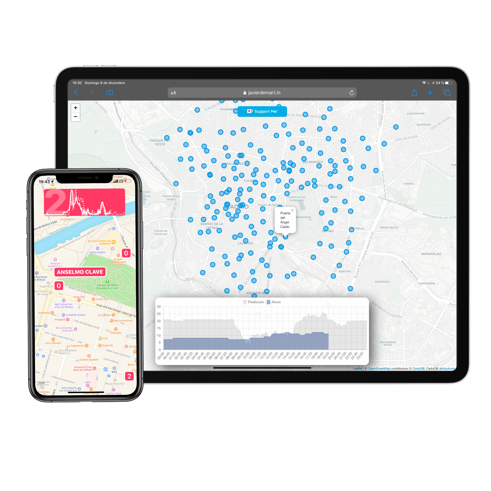

# Neural-Bikes

[](https://ko-fi.com/H2H814TXG).



I have a brief description and architecture of this project in my [blog](https://javierdemart.in/blog/Bicis_App_Architecture). 

This project is intended to help users that ride bikes from a bike sharing service. It makes daily availability predictions for each station using previous availability data. **At the moment is available for Bilbao & Madrid, I'm currently working on an update to support more cities**.

Restocking bikes in a system is a difficult problem to solve. Unequal riding patterns lead to completely full or empty stations. Either one is a problem for users, they won't be able to use the service in normal conditions.

## Usage

Neural Bikes is a Machine Learning backend for my project, Bicis. A service to predict bike sharing availability and help users of those services.

* [Web](http://neural.bike)
* [iOS app](http://app.neural.bike)
* API, available endpoints:

```
https://javierdemart.in/api/v1/prediction/madrid
https://javierdemart.in/api/v1/today/madrid

https://javierdemart.in/api/v1/prediction/bilbao
https://javierdemart.in/api/v1/today/bilbao
```

## Where does the data come from?

Every bike sharing service has a public dataset that shows in real time all the availability for all the stations. I am running a `cron` job in my server every ten minutes and saving the data to a time series database.


I am using InfluxDB, a time-series database, to store my data. Predictions in the `Bicis_CITY_Prediction` database and daily availability in the `Bicis_CITY_Availability` database.

If you originally have your data stored in a `.csv` file you can use the [`influx_db_importer`](https://github.com/javierdemartin/neural-bikes/blob/master/influx_db_importer.py) script. The file should have the following columns:

* `datetime`
* `weekday`
* `station_name`
* `free_bikes`

## Prerequisites

To train the neural network the data is gathered from a time series database, [InfluxDB](https://www.influxdata.com/products/influxdb-overview/). Prior to doing feature engineering the values used to train the model are `datetime`, `station_name`, `free_bikes`. 

## Well, how does this work?

When training the model all the available data is downloaded from the database of the specified city.

Initially there is a first analysis, splitting the `datetime` column into `day_of_year`, `time` and `weekday`. After that a cluster analysis is performed to identify all the possible types of stations, residential areas, work places and unused stations.

Finally, in case there are missing rows they are filled and then the dataset is transformed to a supervised learning problem.

### Clustering

Start off analyzing the usage patterns during the days. If you use a bike sharing service you have a mental model of the busiest and quietest stations. To understand more deeply every neighbourhood and the possible variations in the city I classified the stations. This script produces a classification of the stations in categories depending of the behaviour.

To read a more detailed analysis of the clustering of stations in Bilbao head [here](https://javierdemart.in/cluster).

### Training

The training process is run via the `main.py` script. This gathers the availability data from the InfluxDB database and starts doing the processing.

### Predicting

Calling the `tomorrow.py` script at midnight of any day will get yesterday's data and then make a prediction for today's bike availability. It's saved to the prediction database, `Bicis_CITY_Prediction`.

### Uploading the data 

There is another [repo](https://github.com/javierdemartin/neural-bikes-backend) that does this.

* Every ten minutes the server updates the daily availability
* At midnight every day data from the previous day is queried from the database, runs the prediction script, appends it to a new database and uploads it to the server.

The data that is served to the users, either the app or web, is stored in iCloud using CloudKit.

