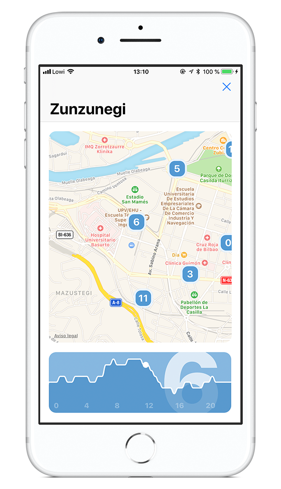

**Project is almost finished, doing some final tests. It will be deployed on the app in the final quarter of this year**

# ML predictions for Bike sharing services

Bike sharing can be useful for the citizens but can lead to a lot of headaches due to unforeseen complications.

Not all the users have the same riding patterns and planning a service doesn't improve the result. These services have to be load balanced to avoid empty stations and keeping up to the balance.

Trying to solve those imbalance by predicting station availability with neural networks. This experiment will be done for Bilbao, will try later to do this for more cities.

## Tests

Until the neural network is fully functional, I am working adding new tests I am performing on the [`tests`](https://github.com/javierdemartin/neural-bikes/tree/master/tests) folder. Later on that folder will disappear and will be substituted with the final solution.

## Where does the data come from?

Most cities have Open Data portals like the one in [Bilbao](https://www.bilbao.eus/opendata/es/inicio). You can get a lot of information from there. Unfortunately what you need for training a neural network is a historic of data not real time data. I have solved that by gathering the availability for more than 20 cities on my server. 

## What's the use of this?

> Bicis app

I am the iOS developer of [Bicis](https://itunes.apple.com/es/app/bicis-bilbon-bizi/id1275889928?mt=8). It makes predictions of the bike availability for each day of the week, they are not as precise as they could be. My plan is to make those predictions using `neural-bikes` so they improve.
