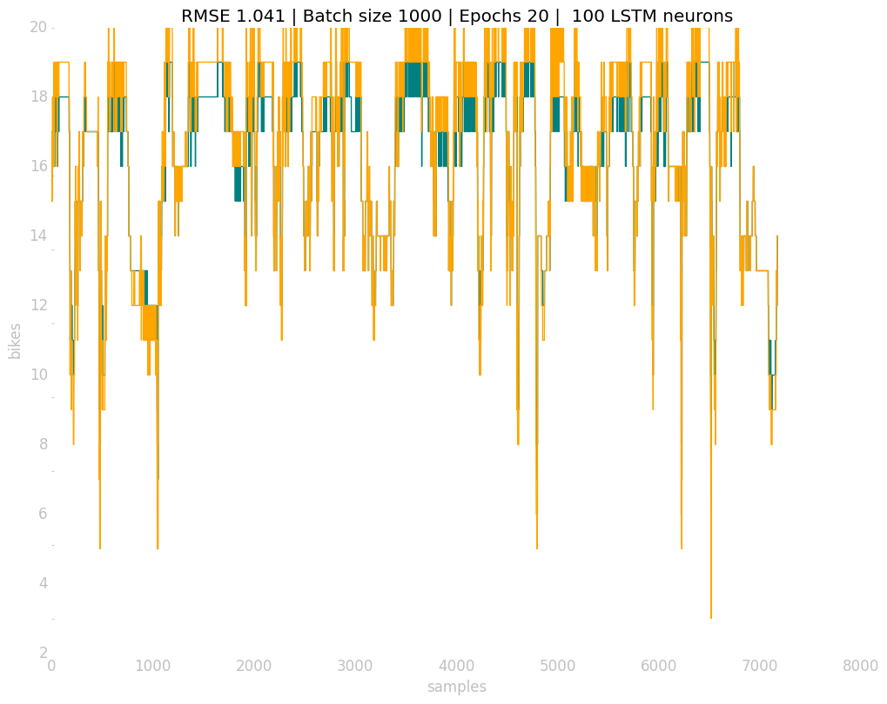
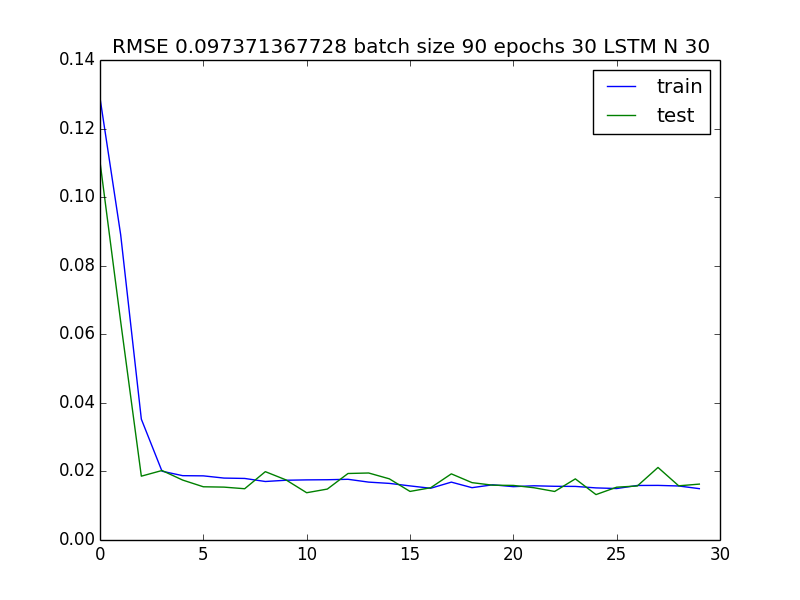

# Test 1

> Neural Network shape stacking LSTM + Dense into a Sequential model

First test as a multivariate neural network providing as inputs

* Free bikes (what I want to predict)
* Weekday
* Month  (tried giving as input the date but the results weren't good)
* Hour

## Results

|  Set  	| Training Set 	| Test Set 	| Epochs 	| Batch Size 	| RMSE         |
|:-----:	|:------------:	|:--------:	|:------:	|:----------:	| :----------: |
| 18033 	|      67%     	|    33%   	|   20   	|     80     	| 0.097        |

## Accuracy

> This doesn't look good at all 🙃

## Loss

