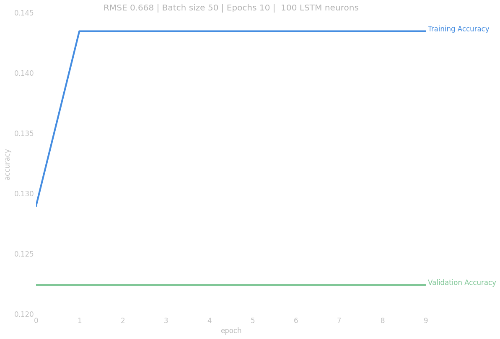
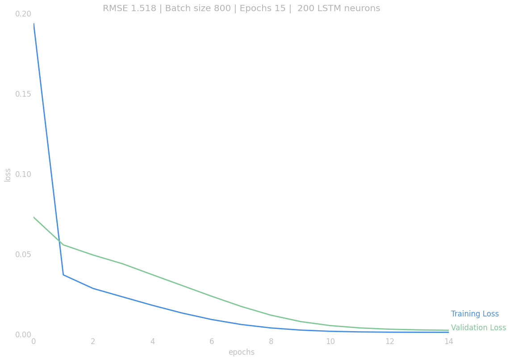
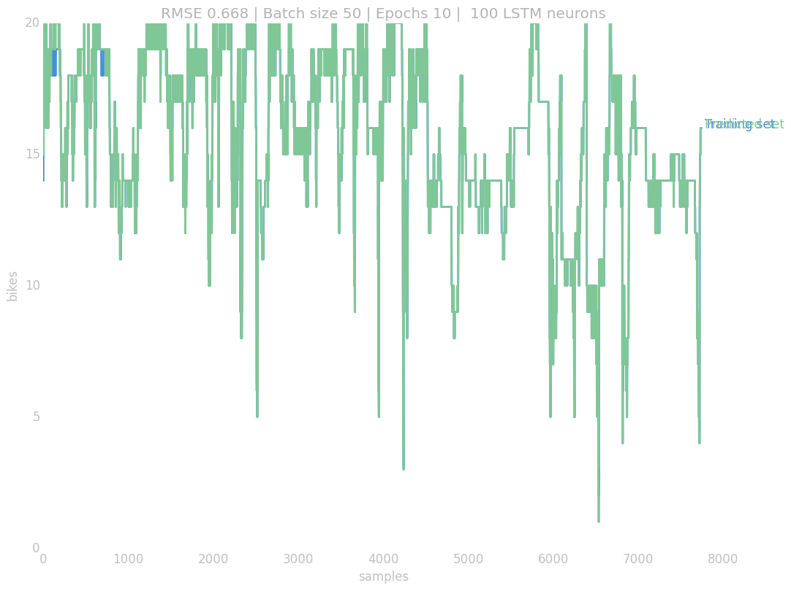

# Test 1

## Data, Input...

Input for the nn:

| month | hour | weekday | free\_bikes |
|:-----:|:----:|:-------:|:-----------:|

The only value that is predicted is `free_bikes` and only for one station (Zunzunegi in Bilbao), in further tests all the stations will be added.

## Neural Network Shape

> Model of the network generated by Keras

## Plots & Results

> Accuracy Plot

Prediction has been rounded to `int` to approximate the values to real use cases, bikes are integers not floats. If the value is not rounded and left as a `float` the RMSE increases a bit but it's not a great improvement.

> Loss Plot using as loss = 'mean\_squared\_error' when compiling the model

> Predicted and real values
