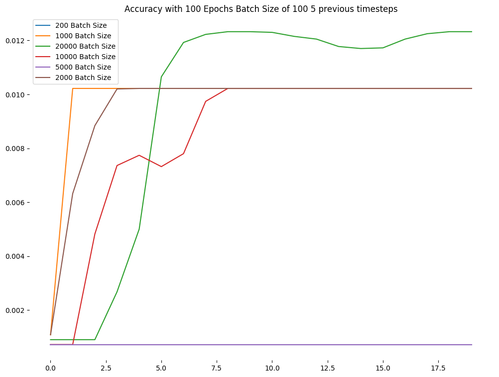

# Test 4

## Changes

### Encoding

Previously I encoded the day of the year, weekday and time using a `LabelEncoder`. It would encode, for example, the hours like this `00:00` as `0`, `00:05` as `1`, ... `23:55` as `287`.  It is obvious that before midnight comes `23:55` but given that encoding it's not that obvious, those two values are `286` numbers away. I encoded the same way the day of the year and the weekday.

Time is a continuous function so I am expressing it as a sine and cosine functions.

<div align = "center">
  +
  =
 
</div>

Also I previously one-hot encoded the number of bikes, that gave an increase in accuracy when fitting the model but the neural network basically learnt to predict the previously fed value. As I am not interested in predicting the exact position of the bike in the dock I don't need to do this kind of encoding.

# Model

```python
model = Sequential()
model.add(LSTM(lstm_neurons, batch_input_shape=(batch_size, train_x.shape[1], train_x.shape[2]), stateful=False))
model.add(Dense(1))
model.compile(loss='mean_squared_error', optimizer='adam', metrics = ['mse'])
```

> Batch training

## Plots

<div align = "center">
 
 
 
</div>

> Accuracy, Loss and MSE plots

There's something wrong here for sure...
