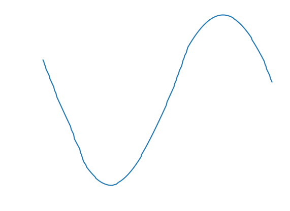
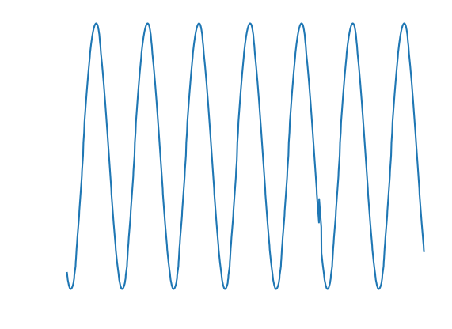
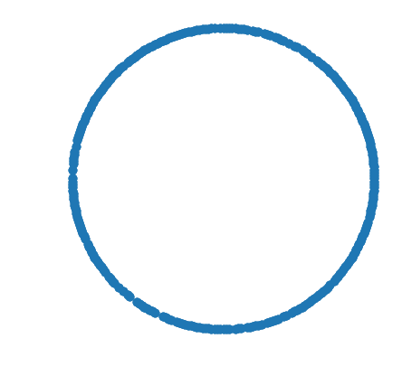
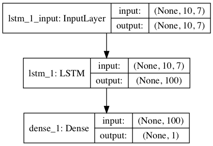
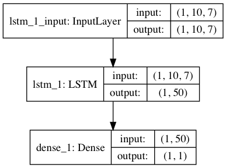
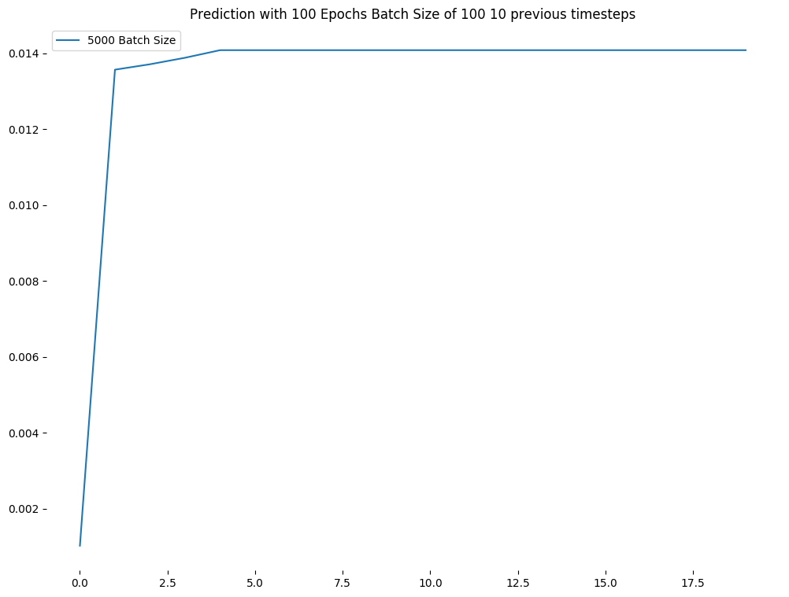
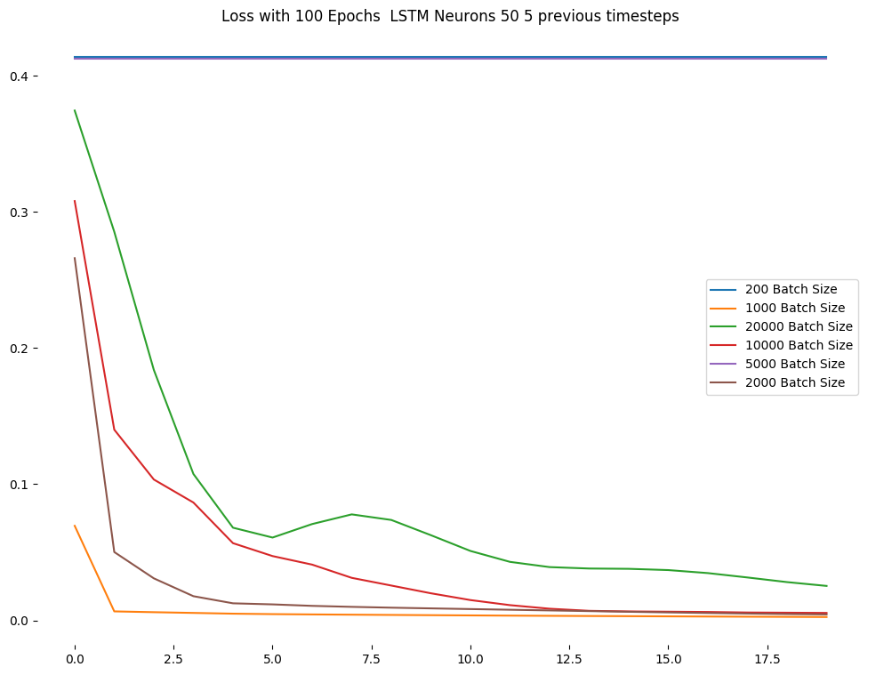
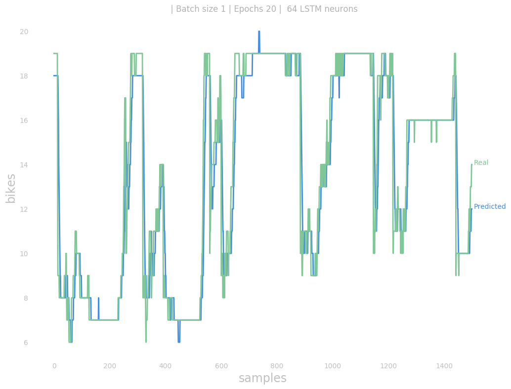
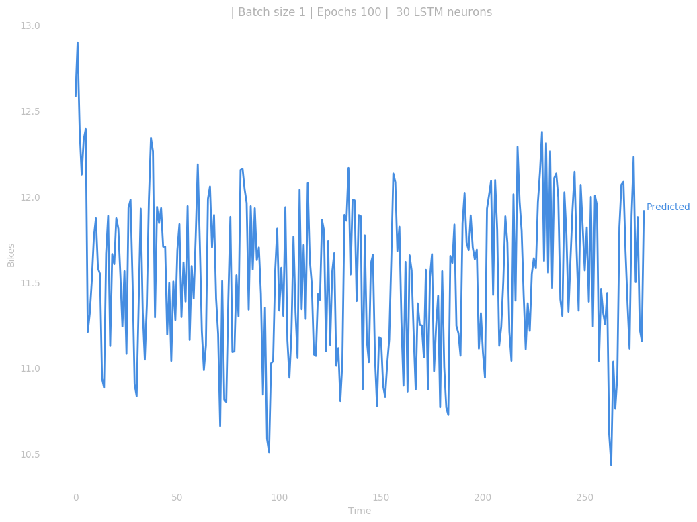

# Test 4

## Changes

### Encoding

Previously I encoded the day of the year, weekday and time using a `LabelEncoder`. It would encode, for example, the hours like this `00:00` as `0`, `00:05` as `1`, ... `23:55` as `287`.  It is obvious that before midnight comes `23:55` but given that encoding it's not that obvious, those two values are `286` numbers away. I encoded the same way the day of the year and the weekday.

Time is a continuous function so I am expressing it as a sine and cosine functions.

<div align = "center">
  +
  =
 
</div>

Also I previously one-hot encoded the number of bikes, that gave an increase in accuracy when fitting the model but the neural network basically learnt to predict the previously fed value. As I am not interested in predicting the exact position of the bike in the dock I don't need to do this kind of encoding.

After all this the input features would be the following 7 columns

```
time_sin | time_cos | hour_sin | hour_cos | wday_sin | wday_cos | bikes
```

# Model

<div align = "center">
 
</div>

> Training the model using batch training

```python
model = Sequential()
model.add(LSTM(lstm_neurons, batch_input_shape=(batch_size, time_steps, 7), stateful=False))
model.add(Dense(1))
model.compile(loss='mean_squared_error', optimizer='adam', metrics = ['mse'])
```

> Batch training

<div align = "center">
 
</div>

> Stateful model used for online predictions

After training the model I switch to a stateful network with batch size `1`. With that I can predict one sample and then with the predicted data feed it to the model and predict again.

```python
model = Sequential()
model.add(LSTM(lstm_neurons, batch_input_shape=(1, time_steps, 7), stateful=True))
model.add(Dense(1))
model.compile(loss='mean_squared_error', optimizer='adam', metrics = ['mse'])
model.load_weights("model/model.h5")
```

## Plots

Different plots based on varying the batch size as input

<div align = "center">
 

</div>

> Accuracy

Accuracy never goes above `0.0XX`.


<div align = "center">
 
</div>

> Loss

<div align = "center">
 
</div>

> MSE


<div align = "center">
 
</div>

> Prediction using sample data

Actually prediction is kinda off, hence the `0.01` accuracy, but seeing the plot it's not bad at all.


<div align = "center">
 
</div>

> Predictions done creating my data


There's something wrong here for sure...
